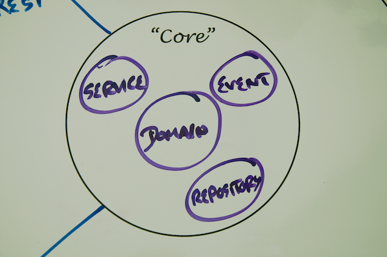
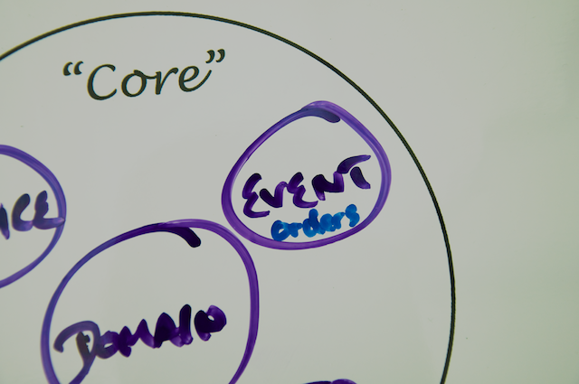
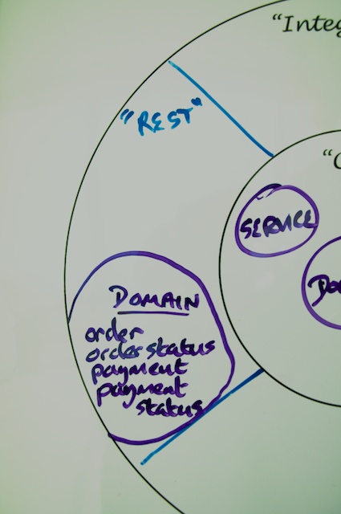
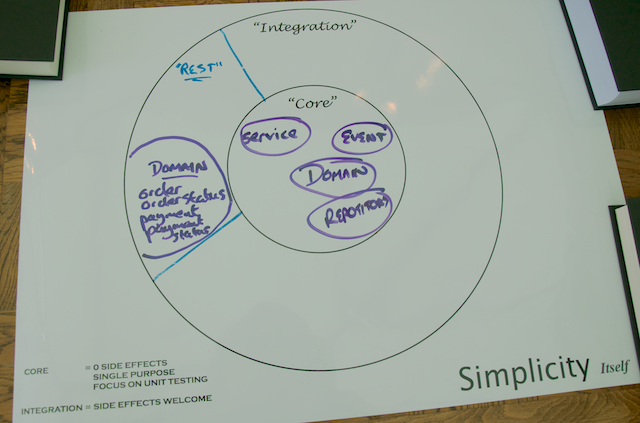

# Step 1: Modelling the Core and RESTful Web Service Domains

For the first version of your new Yummy Noodle Bar RESTful service, the ability to create, update, and remove Orders is the focus.

It is tempting simply to expose the Core Order domain to the outside world and work from there, but that would ignore the boundary between the Core and the RESTful service domain and would lead to the REST API being driven by the internal application structure, and so becoming coupled to that internal structure.

The public API of your service (the RESTful service domain) that you will expose to clients needs to change at a rate that is friendly to those clients. The Core needs to evolve at a rate that corresponds to the Yummy Noodle Bar system's need to evolve internally. Potential friction exists between the two domains as they may need to evolve at different rates.

To manage this friction you need to create concepts and components in the RESTful service domain that are unique to, and can evolve at the rate needed by, the RESTful domain itself. This may result in similar types of components to those in the Core domain but because their purpose will be very different, the similarities are superficial.

In the Core domain the concepts are captured as part of the internal ubiquitous language of the application's domain. In the REST domain the concepts are captured as they are used purely for the purpose of exposing the public RESTful interface. 

## Components of the Core application domain for Yummy Noodle Bar



Open the `initial` project. Under `src/main/java/com/yummynoodlebar/core/domain`, you see the components of the core, application-internal domain of Yummy Noodle Bar:

* **Order**. An individual order in the system that has an associated status and status history for tracking purposes.

* **OrderStatus**. Current status allocated to an `Order`.

* **Payment**. Payment that a customer wants to make for a given `Order`.

* **PaymentDetails**. Details of the `Payment` that a customer wants to make for a given `Order`.

* **PaymentStatus**. Current status of a `Payment` that a customer wants to make for a given `Order`.

This tutorial focuses on the `Order` domain class, which can be acted upon by a number of events under the `com.yummynoodlebar.events.orders` package as shown on the following diagram:



The `Order` domain objects looks like this:

`src/main/java/com/yummynoodlebar/core/domain/Order.java`
```java
package com.yummynoodlebar.core.domain;

import com.yummynoodlebar.core.events.orders.OrderDetails;
import org.springframework.beans.BeanUtils;

import java.util.*;

public class Order {

  private final Date dateTimeOfSubmission;
  private Map<String, Integer> orderItems;
  private final UUID key;
  private Customer customer;

  private OrderStatus status;
  private List<OrderStatus> statusHistory;

  public Order(final Date dateTimeOfSubmission) {
    this.key = UUID.randomUUID();
    this.dateTimeOfSubmission = dateTimeOfSubmission;
    statusHistory = new ArrayList<OrderStatus>();
  }

  public void addStatus(OrderStatus newStatus) {
    statusHistory.add(newStatus);
    status = newStatus;
  }

  public OrderStatus getStatus() {
    return status;
  }

  public Date getDateTimeOfSubmission() {
    return dateTimeOfSubmission;
  }

  public UUID getKey() {
    return key;
  }

  public void setOrderItems(Map<String, Integer> orderItems) {
    if (orderItems == null) {
      this.orderItems = Collections.emptyMap();
    } else {
      this.orderItems = Collections.unmodifiableMap(orderItems);
    }
  }

  public Map<String, Integer> getOrderItems() {
    return orderItems;
  }

  public boolean canBeDeleted() {
    return true;
  }

  public OrderDetails toOrderDetails() {
    OrderDetails details = new OrderDetails();

    BeanUtils.copyProperties(this, details);

    return details;
  }

  public static Order fromOrderDetails(OrderDetails orderDetails) {
    Order order = new Order(orderDetails.getDateTimeOfSubmission());

    BeanUtils.copyProperties(orderDetails, order);

    return order;
  }
}
```
	
You can view the rest of the domain objects [here](https://github.com/spring-guides/tut-rest/tree/master/initial/src/main/java/com/yummynoodlebar/core/domain).

Events in this case decouple the domain concepts in the core of the Yummy Noodle Bar application from the various integrations that may need to access and work upon the core. 

The event components associated with Orders include:

* **RequestAllOrdersEvent** and **AllOrdersEvent**. Corresponding events to request the associated OrderDetails about all Orders and the response to that request.

* **CreateOrderEvent** and **OrderCreatedEvent**. Corresponding events to request the creation of a new Order, and a confirmation that the new Order has been created.

* **DeleteOrderEvent** and **OrderDeletedEvent**. Corresponding events to delete an existing Order and then to confirm that the Order has been deleted.

* **RequestOrderDetailsEvent** and **OrderDetailsEvent**. Corresponding events to request the current details of an Order, and then to receive those details.

* **RequestOrderStatusEvent** and **OrderStatusEvent**. Corresponding events to request the current status of an Order, and then to receive the current status.

* **SetOrderPaymentEvent**. Triggered when Payment is to be set on an existing Order.

* **OrderUpdatedEvent**. Triggered when an Order is updated.

You can view the code for these events [here](https://github.com/spring-guides/tut-rest/tree/master/initial/src/main/java/com/yummynoodlebar/core/events/orders).

## Model the orders and order resources

There are three stages to modeling your RESTful service domain:

* Design your resources. What resources do you need to expose to the outside world?
* Design your URIs. How will your resources be publicly addressed?
* Add operations. What operations can you perform on your RESTfully exposed resources?

### Design your resources

To determine the resources that you will support through your RESTful service, look for the relevant nouns in your domain. In the case of the Yummy Noodle Bar, the following nouns are candidates for exposure to the outside world from the core domain:

* Customer
* Order
* OrderStatus
* OrderStatusHistory
* Payment
* PaymentDetails
* PaymentStatus

The purpose of the Yummy Noodle RESTful service is to submit and track orders as they are executed and delivered. Therefore, we don't need to expose all of these domain concepts via REST. Instead we can focus on exposing the following subset:

* Order
* OrderStatus
* PaymentDetails
* PaymentStatus

The updated life preserver shows where these domain components will live in the design.



As mentioned before, although these concepts exist in both the Core domain and the RESTful Service domain, this is not duplication as the purpose of the implementations are very different from Core to REST.

### Design your resource URIs

While these resources will be represented by a class in code, you must first decide the REST API. That is because the REST API will drive the design of code and the implementation of the resources.

Each resource needs to be addressable by a URI. In addition, the address implies the relationship between each of the resources.

For your Yummy Noodle Bar RESTful Service domain, the resources will have the following URIs:

* All Orders

        http://www.yummynoodlebar.com/aggregators/orders

* One `Order`

        http://www.yummynoodlebar.com/aggregators/orders/{Order ID}

* Current `OrderStatus` for one `Order`

        http://www.yummynoodlebar.com/aggregators/orders/{Order ID}/status

* `PaymentDetails` for one `Order`

        http://www.yummynoodlebar.com/aggregators/orders/{Order ID}/paymentdetails

* `PaymentStatus` for one `Order`

        http://www.yummynoodlebar.com/aggregators/orders/{Order ID}/paymentstatus

#### URI templates

Each of the above URIs are expressed as *templates*; they contain blocks demarcated with {} in the URI. Because the URI in a RESTful service should completely address the resource, without any additional query parameters, parts of the URI are specific to the resource itself.  

For example, here the {} notation specifies where an Order with Order ID of 1 would have the following specific URL once the URI template is furnished with the Order Number:

    http://www.yummynoodlebar.com/aggregators/orders/1

An Order with an Order ID of 37 would have the following specific URI:

    http://www.yummynoodlebar.com/aggregators/orders/37

This quality of the URI changing to work with specific resources is what gives a resource the quality of being *addressable*.

### Add the operations (HTTP methods)

Along with the URLs you're going to expose for the RESTful service for each resource, you also need to decide what can be done to each resource.

RESTful services rely on the HTTP methods passed as part of an HTTP request header to tell the service what needs to be done with the addressed resource. The full set of HTTP methods allowed constitute the [uniform interface](http://en.wikipedia.org/wiki/Representational_state_transfer) to RESTful services.

The following methods are supported.

<table>
   <thead>
	<tr>
		<th>HTTP Method</th>
		<th>Description</th>
	</tr>
	</thead>
	<tbody>
	<tr>
		<td>GET</td>
		<td>Retrieves a representation of the resource addressed by the URI used to submit the HTTP request upon.</td>
	</tr>
	<tr>
		<td>POST</td>
		<td>Creates a new resource under the URI used to submit the POST HTTP Request upon.</td>
	</tr>
	<tr>
		<td>PUT</td>
		<td>Updates the resource indicated by the URI used to submit the HTTP request upon. If a resource did not already exist at the specified URI, then a new resource at the specified address will be created.</td>
	</tr>
	<tr>
		<td>DELETE</td>
		<td>Removes the resource from the system where it is addressed by the URI used to submit the HTTP request upon.</td>
	</tr>
	<tr>
		<td>HEAD and OPTIONS</td>
		<td>Retrieve various meta-data about the resource addressed by the URI used to submit the HTTP request upon.</td>
	</tr>
	</tbody>
</table>

The HTTP 1.1 Specification provides a detailed description of all the HTTP Methods.

POST and PUT have similar but not identical functions. You use POST to create new entities without knowing the final URI, and you use PUT to create and update entities in a previously known URI.

The following table describes what HTTP methods will be supported for each resource address.

<table>
    <thead>
	<tr>
		<th>Resource URI</th>
		<th>Supported HTTP Methods</th>
		<th>Description</th>
	</tr>
	</thead>
	<tbody>
	<tr>
		<td>/aggregators/orders</td>
		<td>GET</td>
		<td>Asks for a representation of all of the orders.</td>
	</tr>
	<tr>
		<td>/aggregators/orders</td>
		<td>POST</td>
		<td>Attempt to create a new order, returning the location (in the Location HTTP Header) of the newly created resource.</td>
	</tr>
	<tr>
		<td>/aggregators/orders/{id}</td>
		<td>GET</td>
		<td>Asks for a representation of a specific Order resource.</td>
	</tr>
	<tr>
		<td>/aggregators/orders/{id}</td>
		<td>DELETE</td>
		<td>Requests the deletion of a specified Order resource.</td>
	</tr>
	<tr>
		<td>/aggregators/order/{id}/status</td>
		<td>GET</td>
		<td>Asks for a representation of a specific Order's current status.</td>
	</tr>
	<tr>
		<td>/aggregators/order/{id}/paymentdetails</td>
		<td>GET</td>
		<td>Asks for a representation of a specific Order's payment details resource.</td>
	</tr>
	<tr>
		<td>/aggregators/order/{id}/paymentdetails</td>
		<td>PUT</td>
		<td>Updates a specific Order's payment details resource.</td>
	</tr>
	</tbody>
</table>


## Capture status codes

No RESTful design is complete without considering responses to requests. Now is the time to capture the [HTTP Status Codes](http://www.w3.org/Protocols/rfc2616/rfc2616-sec10.html) your service will respond with for a given combination of URI and HTTP method on a request.

The following table describes the HTTP status codes that each of your URIs and HTTP method combinations will respond with.

<table>
    <thead>
	<tr>
		<th>Resource URI</th>
		<th>Supported HTTP Methods</th>
		<th>Supported HTTP Status Codes</th>
	</tr>
	</thead>
	<tbody>
	<tr>
		<td>/aggregators/orders</td>
		<td>GET</td>
		<td>200 (OK, Success)</td>
	</tr>
	<tr>
		<td>/aggregators/orders</td>
		<td>POST</td>
		<td>201 (Created) if the Order resource is successfully created, in addition to a Location header that contains the link to the newly created Order resource; 406 (Not Acceptable) if the format of the incoming data for the new resource is not valid</td>
	</tr>
	<tr>
		<td>/aggregators/orders/{id}</td>
		<td>GET</td>
		<td>Asks for a representation of a specific Order resource.</td>
	</tr>
	<tr>
		<td>/aggregators/orders/{id}</td>
		<td>DELETE</td>
		<td>200 (OK); 404 (Not Found) if Order Resource not found</td>
	</tr>
	<tr>
		<td>/aggregators/orders/{id}/status</td>
		<td>GET</td>
		<td>200 (OK); 404 (Not Found) if Order Resource not found</td>
	</tr>
	<tr>
		<td>/aggregators/orders/{id}/paymentdetails</td>
		<td>GET</td>
		<td>200 (OK); 404 (Not Found) if Order Resource not found</td>
	</tr>
	<tr>
		<td>/aggregators/orders/{id}/paymentdetails</td>
		<td>PUT</td>
		<td>201 (Created); 406 (Not Acceptable) if there is a problem with the format of the incoming data on the new payment details; 404 (Not Found) if Order Resource not found</td>
	</tr>
	</tbody>
</table>

## Summary

Congratulations! You've determined the resources you're going to expose and captured those in the REST domain as shown in the following Life Preserver:



You've also decided the URI addresses of your resources; the HTTP methods that will be supported for requests to those URIs; and finally the HTTP status codes that you intend to return for the requests.

We haven't run any code yet. That's what we'll do in the next section, when we build some services and tests.

[Next… Building Your First RESTful Service](../2/) 