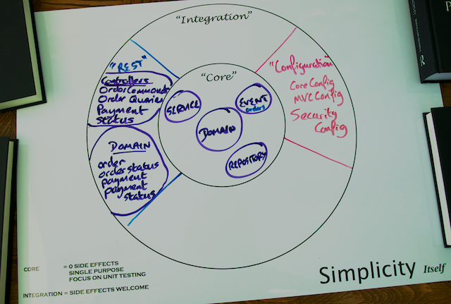

## Quick Recap

In this tutorial you've:

* Constructed a RESTful Integration Domain that effectively encapsulates the concerns of a RESTful API without corrupting the core components of the Yummy Noodle Bar. 
* Designed your RESTful Resources, including their URIs, the HTTP Methods they support and the HTTP Status Codes that they response with.
* Implemented those RESTful Resources using Spring MVC controllers.
* Used Content Negotiation to respond with the right resource representation accordion to what a client has requested.
* Run your RESTful service using Gradle as well as packaged your service as a WAR file.
* Tested your RESTful service functionality using Spring's `RestTemplate`.
* Secured your service's URIs from access by unauthorised clients.
* Implemented HATEOAS to make your services' resources and relationships between those resources discoverable by your clients.

You've come a long way and, to show the different domains you've been working in and how they relate to the core of the Yummy Noodle Bar application, your final Life Preserver will look like the following:

We hope you've enjoyed this tutorial! Check out the next steps in the navigation bar for what you might want to explore next.