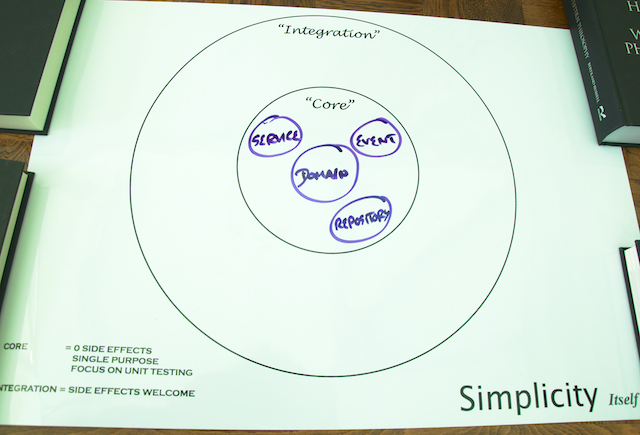
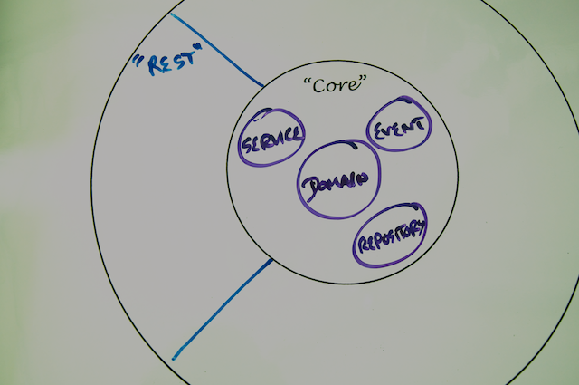

# Designing and Implementing RESTful Web Services with Spring

## Why RESTful Services?

RESTful Web Services are everywhere these days. From integrating with [Amazon Web Services](http://aws.amazon.com) to syndicating multiple feeds of data, RESTful Web Services that follow the guidelines of [Roy Fielding's architectural style](http://www.ics.uci.edu/~fielding/pubs/dissertation/top.htm) are successfully providing simple and effective web APIs that are scalable and performant from a few to a few million users and more.

Since you're reading this tutorial, it's likely that you're considering implementing a RESTful web service because:

* You're creating an API that clients will need to consume across the Web
* You want to open up your organisations data to consumption by varied clients across the web.
* You need to integrate your application with other applications inside your own organisation, but you don't have control over the languages, tools or frameworks that those other applications are likely to be written in.

Or maybe you're just curious to see what a RESTful web service implemented using Spring looks like. Whatever your reason, in this tutorial you're going to take a deep dive into building a production-strength RESTful we service and so if that's your goal, you've come to the right place. 

## What you'll need

To work through this tutorial you'll need a few things:

* About an hour of your time to complete the tutorial.
* An installation of the [Gradle](http://www.gradle.org) build tool, version 1.6 or above.
* A copy of the code (TODO - downloadable as Zip and/or git clone).
* An IDE of your choice; we recommend [Spring Tool Suite](http://www.springsource.org/sts) which is available as a [free download](http://www.springsource.org/sts).

## Yummy Noodle Bar is going Global

Yummy Noodle Bar wants to provide a RESTful web service to a set of aggregators that want to submit orders, in particular “Let’s Nosh” who are a massive brand of aggregator that will potentially bring in big business to the small-scale noodle bar.

The current architecture of the application is shown in the following "Life Preserver" diagram:

Open up the project "Initial" at this point and you'll see that the "Life Preserver" diagram maps to the different packages under src/main/java. 

Inside the application's top level packages, i.e. com.yummynoodlebar, the package structure is broken down as:

* *domain* - This package's purpose is to contain the components that cleanly capture the application's core domain concepts. These classes are a manifestation of the [ubiquitous language](http://martinfowler.com/bliki/UbiquitousLanguage.html) of the core domain.

* *respository* - This package contains components that are responsible for storing and retrieving the current state of the system's domain objects.

* *event* - This package contains components that are the events that the domain can receive and process.

* *service* - This package contains components that handle the actions that can be performed when an event is received.

Take a moment to familiarise yourself with the components in each of these packages. The tests for the core domain components are available in the src/test area in the 'initial' project, so an idea of the expectations of how these components will be used are documented there.

## The Home of RESTful Services in your Application's Architecture

RESTful services are an integration between your application and the myriad of possible clients that need to consume your services. As such, RESTful services can be seen as living in their own integration domain on the periphery of your application's core as shown in the following update to your "Life Preserver".

As an integration between your application and the outside world, there are a number of concerns that need to be addressed in the design and implementation of the components that make up your RESTful services:

* Your RESTful service component's primary purpose implement the necessary functionality for the specific RESTful service you are exposing, and are not necessarily a one-to-one exposure of the internals of your application.
* The components that make up your RESTful services components will need to evolve at a rate that is appropriate for the many consumers that are relying on your services.
* Your RESTful service components should not contain any of the core logic to your application but will collaborate with other components in the Core domains of your application in order to orchestrate the necessary functionality to provide the service interface.

That's enough on the design constraints placed on the components that implement your RESTful services, for this tutorial you've been given the task of helping Yummy Noodle Bar to extend the successful Yummy Noodle Bar internal application to create a new public Web API for submitting, tracking, cancelling and amending orders.

The rest of this tutorial is spread out over the following pages:

* [Step 1: Modelling RESTful Service Domain](1/)
* [Step 2: Building Your First RESTful Service](2/)
* [Step 3: Wiring Up and Deploying your Service](3/)
* [Step 4: Testing your Service using RESTTemplate](4/)
* [Step 5: Securing your Service with Spring Security](5/)
* [Step 6: Make your Service Discoverable using Spring HATEOAS](6/)
* [Recap and Where to go Next?](7/)

